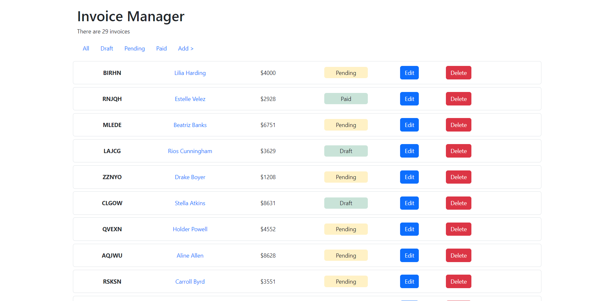

# Invoice Manager

The Invoice Manager is a CRUD web application using PHP.

## Features

- Create a new invoice
- Update existing invoice
- Delete existing invoice

## Screenshots

## Acknowledgements

 - [Professor Michael Eisenbraun](https://michaeleisenbraun.com/)

 ## Authors

- [@o2thur](https://www.github.com/o2thur)

## License

[MIT](https://choosealicense.com/licenses/mit/)